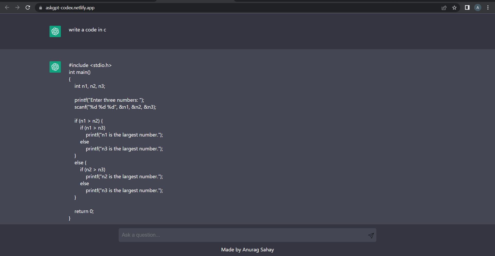

# AskGPT - Codex

A ChatGPT AI based Application that will help you code and take help of this AI whenever you are stuck. A reliable App based on Text-davinci-003.


## How to use
### for Client 
Clone the project

```bash
  git clone https://github.com/anuragsahay5/AskGPT-Codex/
```

Go to the project directory

```bash
  cd client
```

Install dependencies

```bash
  npm install
```

Start the client

```bash
  npm run dev
```
### for Server 
Clone the project

```bash
  git clone https://github.com/anuragsahay5/AskGPT-Codex/
```

Go to the project directory

```bash
  cd server
```

Install dependencies

```bash
  npm install
```

Start the server

```bash
  node index
```


## Environment Variables

To run this project, you will need to add the following environment variables to your .env file in server folder.

`OPENAI_API_KEY`


## Libraries

- ``` React ``` : As the frontend javascript library to build the frontend.

- ``` Axios ``` : Used Axios library to make API calls to backend.

- ``` Vite ``` : Used Vite as the build tool. Much faster and developer friendly.


## Screenshots



